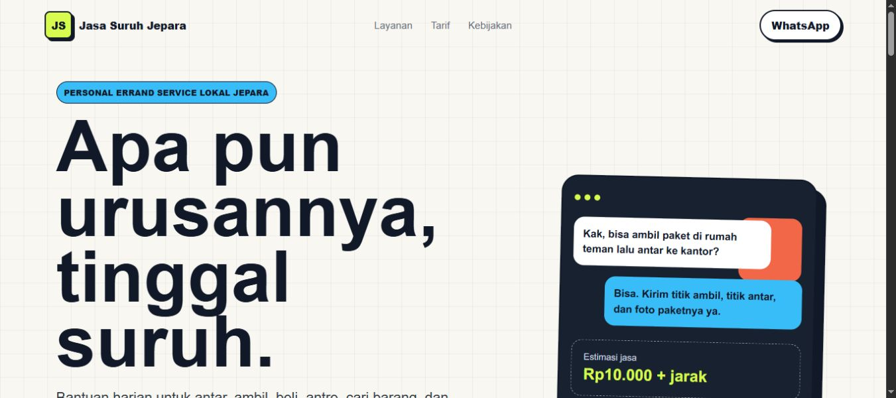

# Jasa Suruh Jepara

Landing page statis untuk layanan bantuan harian lokal di Jepara.

**Apa pun urusannya, tinggal suruh.**

[](https://jasasuruhjepara.isacool.my.id/)
[](#tech-stack)

## Website Preview



## Poster Preview


## Overview

Jasa Suruh Jepara adalah konsep **personal errand service** untuk membantu kebutuhan harian seperti mengambil barang, mengantar dokumen, membeli kebutuhan, antre, mencari barang, dan permintaan khusus yang aman serta legal.

Repo ini berisi versi landing page yang dibuat **super ringan**: hanya HTML, CSS, dan SVG. Tidak ada framework, build step, database, atau runtime Node.js di server.

## Live Site

Website aktif:

[https://jasasuruhjepara.isacool.my.id/](https://jasasuruhjepara.isacool.my.id/)

## Tech Stack

- HTML statis
- CSS responsif
- SVG favicon
- Apache virtual host untuk VPS produksi
- Nginx config contoh jika ingin migrasi ke Nginx

## Project Structure

```text
.
├── index.html
├── styles.css
├── favicon.svg
├── screenshot-website.png
├── poster-jasa-suruh-jepara-v2.png
├── apache-jasasuruhjepara.conf
├── nginx-jasasuruhjepara.conf
└── README.md
```

## Local Preview

Jalankan server statis sederhana dari root project:

```bash
python -m http.server 8080
```

Lalu buka:

```text
http://localhost:8080
```
